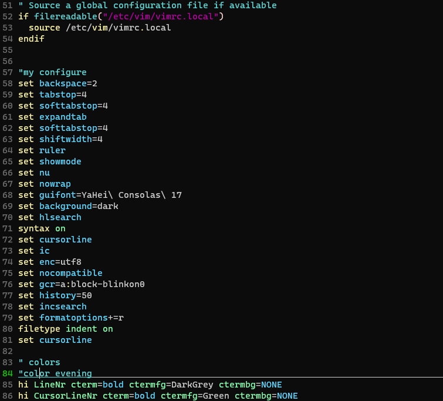

# vim

## path /etc/vim/vimrc

``` vimrc
" Source a global configuration file if available
if filereadable("/etc/vim/vimrc.local")
  source /etc/vim/vimrc.local
endif


"my configure
set backspace=2
set tabstop=4
set softtabstop=4
set expandtab
set softtabstop=4
set shiftwidth=4
set ruler
set showmode
set nu
set nowrap
set guifont=YaHei\ Consolas\ 17
set background=dark
set hlsearch
syntax on
set cursorline
set ic
set enc=utf8
set nocompatible
set gcr=a:block-blinkon0
set history=50
set incsearch
set formatoptions+=r
filetype indent on
set cursorline

" colors
"color evening
hi LineNr cterm=bold ctermfg=DarkGrey ctermbg=NONE
hi CursorLineNr cterm=bold ctermfg=Green ctermbg=NONE
```


